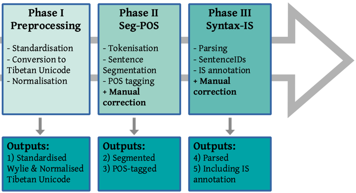

# Tools for the Annotated Corpora of Tibetan (ACTib)

!!!DISCLAIMER: WORK IN PROGRESS!!!

This repository will soon contain all scripts and links to the annotated corpora of Tibetan: ACTib and PACTib. When using any part of this repo, please cite the relevant accompanying paper(s), abstracts of which can be found below.

**Christian Faggionato, Nathan Hill, and Marieke Meelen. 2022.*** NLP Pipeline for Annotating (Endangered) Tibetan and Newar Varieties. In *Proceedings of the Workshop on Resources and Technologies for Indigenous, Endangered and Lesser-resourced Languages in Eurasia within the 13th Language Resources and Evaluation Conference*, pages 1–6, Marseille, France. European Language Resources Association.

**Meelen, Roux & Hill 2021**, 'Optimisation of the Largest Annotated Tibetan Corpus Combining Rule-based, Memory-based, and Deep-learning Methods' *ACM Transactions on Asian and Low-Resource Language Information Processing* Volume 20:1, pp 1–11, DOI: https://dl.acm.org/doi/10.1145/3409488

**Meelen & Roux 2020**, 'Meta-dating the PArsed Corpus of Tibetan (PACTib)' *Proceedings of the 19th International Workshop on Treebanks and Linguistic Theories*, pp. 31–42, DOI: https://www.aclweb.org/anthology/2020.tlt-1.3/

## Tools & Dependencies

This repo currently presents tools to preprocess, segment and POS tag Old and Classical Tibetan specifically, focused on subsequent linguistic tasks (but useful for any downstream NLP tasks). It combines Esukhia's BOTOK tokeniser with a syllable-based classifier for optimal Classical Tibetan segmentation and uses the Memory-Based Tagger for POS tagging:

- [Pyewts](https://pypi.org/project/pyewts/) (for Preprocessing)
- [Botok tokeniser](https://github.com/Esukhia/botok) (for Segmentation)
- [Memory-Based Tagger](https://github.com/LanguageMachines/mbt/) (for Segmentation & POS tagging)
- [Natural Language Toolkit](https://www.nltk.org/) (for Parsing)

It also contains a preliminary sentence segmenter, which is currently only optimised for specific project purposes.

NOTE that for POS tagging, we also tested neural-network based approaches, but results are still worse for Classical Tibetan, which is why we keep using the MBT for now. Preliminary tests with improved word embeddings indicate accuracies for BiLSTM-RNN taggers are likely to improve as soon as better embeddings are implemented (see Meelen, Roux & Hill 2021).

## Preprocessing (for Old Tibetan and/or Wylie transcriptions)

Texts in Classical Tibetan Unicode can directly be used as input for word segmentation (tokenisation) and POS tagging. Old Tibetan texts or texts that are transcribed in the Wylie transcription convention, however, need to be preprocessed first. Preprocessing of Old Tibetan texts can be done with any transcribed text taken from the [OTDO website](https://otdo.aa-ken.jp/) (which features a specific form of Wylie transcription). The preprocessing script creates three outputs:
- Standardised Wylie
- Tibetan Unicode
- Normalised Tibetan Unicode

The final output 'Normalised Tibetan Unicode' removes typical Old Tibetan orthographical features, 'normalising' them to standard Classical Tibetan on which all subsequent NLP tools of the pipeline are trained. The non-normalised Tibetan Unicode output is preserved, however, for another interested in doing research on Old Tibetan orthographical features.

To preprocess Old Tibetan and/or Wylie transcriptions:

`python preprocessing.py <my_directory>`

## Segmentation & POS tagging

Phase II of our pipeline contains segmentation (of both words and sentences) as well as POS tagging. It generates three types of output:
- tokenised - for LMs/embeddings etc. (word segmentation with 'shunits')
- POS-tagged - for parsing & querying (with corrected sentence segmentation)
- POS-tagged (UD) - for Pyrrha correction (with corrected sentence segmentation)

To run the script:

`python pos-directory.py <my_directory>`

## Parsing & SentenceIDs

After POS tagging, phrase structure can be added with the parsing script. To parse and add automatically add SentenceIDs:

`python tibparse.py <my_POS-taggedtext.txt>`

Just like the UPenn-style historical corpora, constituency-based parsed .psd files can be queried with [CorpusSearch](http://corpussearch.sourceforge.net/) or XQuery after conversion to .psdx with, for example, [Cesax](http://erwinkomen.ruhosting.nl/software/Cesax/).

## Querying POS-tagged files

POS-tagged files can be queried with the dedicated queryPOS.py script, which allows for queries for 1-5 POS sequences as well as wildcards (using \*).

`python queryPOS.py <my_folder>`

It produces an output folder with text files listing all exact matches as well as matches in context for each input file in the folder. Total number of hits per file and for the entire folder are also calculated.

## References with full abstracts

**Faggionato, Hill & Meelen 2022**, 'NLP Pipeline for Annotating (Endangered) Tibetan and Newar Varieties' in *LREC-EURALI Proceedings*
*In this paper we present our work-in-progress on a fully-implemented pipeline to create deeply-annotated corpora of a number of historical and contemporary Tibetan and Newar varieties. Our off-the-shelf tools allow researchers to create corpora with five different layers of annotation, ranging from morphosyntactic to information-structural annotation. We build on and optimise existing tools (in line with FAIR principles), as well as develop new ones, and show how they can be adapted to other Tibetan and Newar languages, most notably modern endangered languages that are both extremely low-resourced and under-researched.*

**Meelen, Roux & Hill 2021**, 'Optimisation of the Largest Annotated Tibetan Corpus Combining Rule-based, Memory-based, and Deep-learning Methods' *ACM Transactions on Asian and Low-Resource Language Information Processing* Volume 20:1, pp 1–11, DOI: https://dl.acm.org/doi/10.1145/3409488
*This article presents a pipeline that converts collections of Tibetan documents in plain text or XML into a fully segmented and POS-tagged corpus. We apply the pipeline to the large extent collection of the Buddhist Digital Resource Center. The semi-supervised methods presented here not only result in a new and improved version of the largest annotated Tibetan corpus to date, the integration of rule-based, memory-based, and neural-network methods also serves as a good example of how to overcome challenges of under-researched languages. The end-to-end accuracy of our entire automatic pipeline of 91.99% is high enough to make the resulting corpus a useful resource for both linguists and scholars of Tibetan studies.*

**Meelen & Roux 2020**, 'Meta-dating the PArsed Corpus of Tibetan (PACTib)' *Proceedings of the 19th International Workshop on Treebanks and Linguistic Theories*, pp. 31–42, DOI: https://www.aclweb.org/anthology/2020.tlt-1.3/
*The PArsed Corpus of Tibetan is new resource that is unique in bringing together a large number of Tibetan texts (>5000) from the 11th century until the present day. The texts in this diachronic corpus are provided with metadata containing information on dates and patron-/authorship and linguistic annotation in theform of tokenisation, sentence segmentation, part-of-speech tags and syntactic phrasestructure. With over 166 million tokens across 11 centuries and a variety of genres, PACTib opens up a wide range of research opportunities for historical and comparativelinguistics and scholars in Tibetan Studies, which we illustrate with two case studies.*

## Available Corpora

The current version of the Annotated Corpus of Classical Tibetan (ACTIB) can be found on [Zenodo](https://zenodo.org/record/3951503#.Yh5VWsanxqs).
